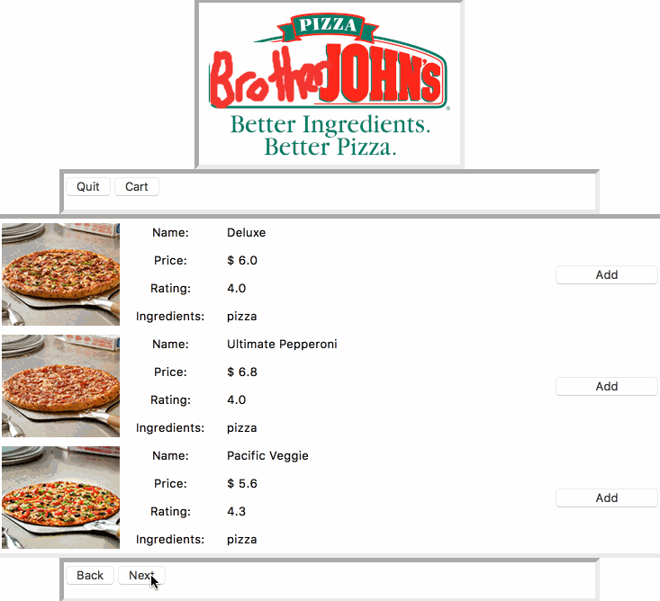

# Software-Engineering

# Using GUI to implement an online pizza ordering system

The software that we design is an Online Pizza Ordering System which serves the people who want to order pizza online from the nearest Pizza store. This system also gives the opportunities for the cook to design their own menu and set the price; the managers who process customer registrations, handle customer compliments and complaints, hire or fire workers, promote or demote customers; and the delivery persons who want to choose the shortest route to arrive the customer from the store.
There are 3 types of customers for each store: visitors, registered customers and VIPs, who received different prices—highest for visitors and lowest for VIPs. One customer can be a VIP for one store, while a mere visitor for another. Online Pizza Ordering System also includes a rating system where customers can give comments and ratings to the pizzas and delivery persons; cooks’ ratings are based on their pizzas’ ratings; delivery persons can give rating to customers. Managers can take actions based on the ratings of customers and workers. Such rating system sets up rules to maintain the system’s stabilization.
This software will work as follows: a customer will make an order online, then the system will show 3 pizza stores that are closest to the address of the customer, the customer can choose the store and cook/topping/dough for as many pizzas as she/he pleases. After the order is made, the manager then decides which delivery people to send the order. The chosen delivery person then decides which route to go for this transaction based on traffic on the road. After an order is finished, the customers must rate the pizzas, store, and delivery people. The delivery people will rate the customers as well. These ratings are important and are used to modify the menus, manage customers and workers, so that the quality of the system can be improved.

